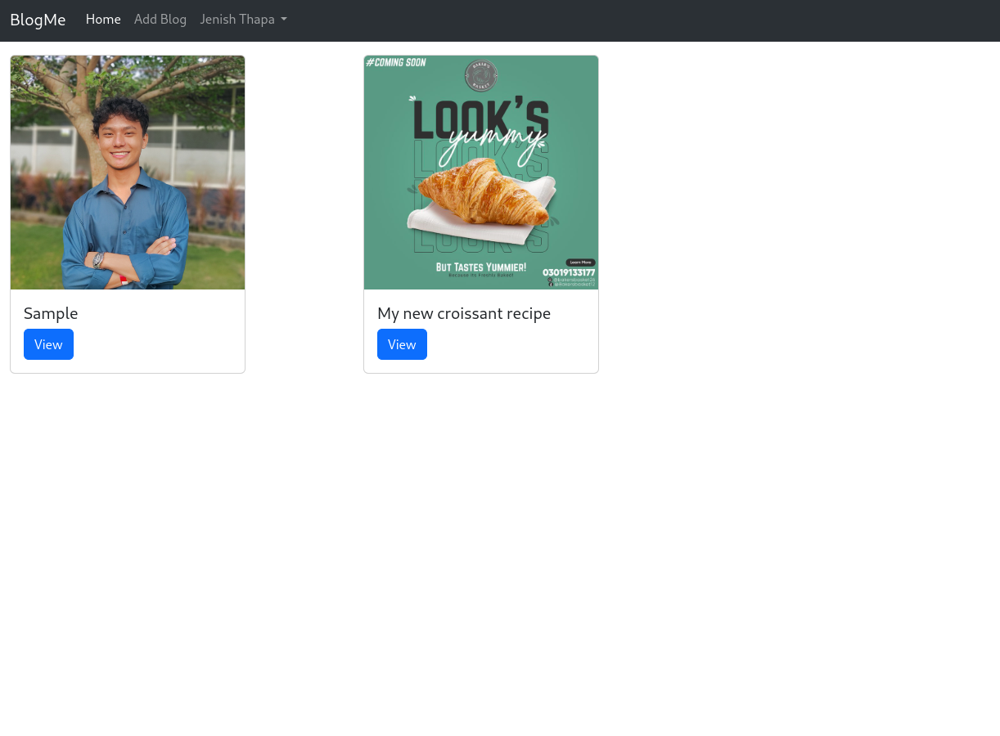
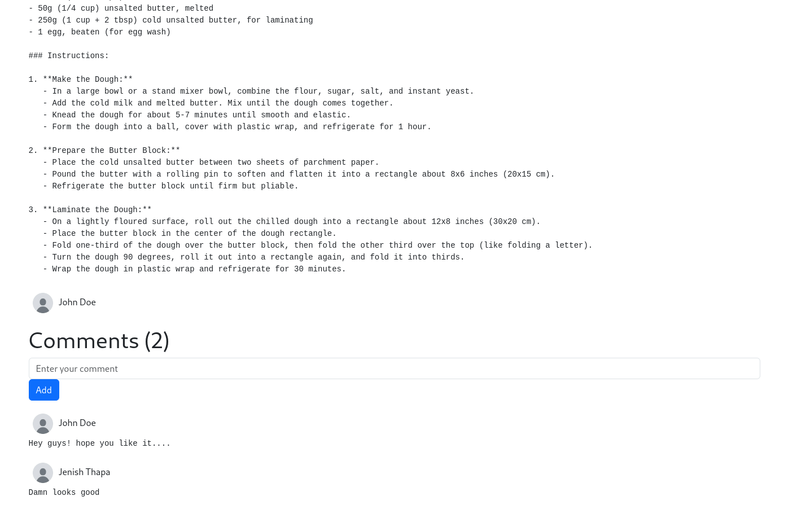

# Blogging Website

This is a blogging website built with Node.js, Express, and EJS for server-side rendering. Users can sign up, log in, add blogs, comment on blogs, and log out.

## Features

- User authentication (sign up, log in, log out)
- Add, edit, and delete blogs
- Comment on blogs
- Server-side rendering using EJS

## Technologies Used

- Node.js
- Express
- MongoDB with Mongoose
- EJS (Embedded JavaScript Templates)
- Passport.js for authentication
- Bootstrap for frontend styling

## Installation

1. **Clone the repository:**
    ```bash
    git clone https://github.com/yourusername/blogging-website.git
    cd blogging-website
    ```

2. **Install dependencies:**
    ```bash
    npm install
    ```

4. **Run the application:**
    ```bash
    npm start
    ```

    The server will start on `http://localhost:8000`.

## Project Screenshots




